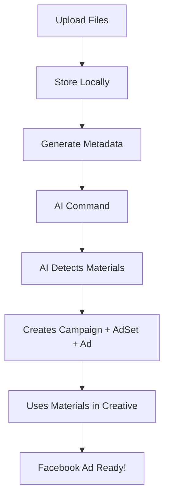

# 🚀 Facebook Ads Manager - Complete Feature Set

## ✅ **All Features Implemented Successfully**

Your Facebook Ads Manager now has **complete functionality** for creating professional Facebook ad campaigns with materials!

---

## 📋 **Core Campaign Features**

### **1. Complete 3-Step Campaign Creation** ✅
- **Campaign Creation**: Set budget, objective, status
- **Ad Set Creation**: Define targeting (age, gender, location, interests)  
- **Ad Creation**: Add creative content with images/videos
- **End Result**: Fully functional Facebook ads ready to serve

### **2. Smart Language Targeting** ✅
- **Geographic Targeting**: "Romanian men" → `countries: ["RO"]`
- **Language Targeting**: "Romanian speakers" → `locales: [locale_id]` 
- **Combined Targeting**: "Russian speakers in Romania" → Both geo + language
- **No Assumptions**: System only adds language when explicitly requested

### **3. Complete Material Upload System** ✅
- **File Upload**: Drag & drop images/videos (JPG, PNG, GIF, MP4, MOV)
- **Storage System**: Local file storage with organized naming
- **AI Integration**: Automatically uses uploaded materials in ads
- **Preview Gallery**: Visual interface to manage uploaded materials

---

## 🎯 **Advanced Features**

### **4. Account Management** ✅
- **Multi-Account Support**: Manage multiple Facebook ad accounts
- **Real-time Data**: Live account metrics and campaign data
- **Account Switching**: Easy switching between different accounts

### **5. AI Command Processing** ✅  
- **Natural Language**: "Create campaign for Romanian men interested in fashion"
- **Smart Parsing**: Automatically extracts targeting, budget, objectives
- **Error Handling**: Robust error recovery and logging
- **Material Integration**: Automatically includes uploaded materials

### **6. Debug & Monitoring** ✅
- **Debug Panel**: Technical debugging interface
- **Action Logging**: Complete log of all AI actions
- **Real-time Feedback**: Live progress updates  
- **Error Tracking**: Detailed error reporting

---

## 🛠️ **Technical Architecture**

### **Frontend (Next.js + TypeScript)**
- **Dashboard UI**: Modern, responsive interface
- **Material Upload**: Drag & drop file upload system
- **Real-time Updates**: Live campaign and account data
- **Debug Tools**: Advanced debugging capabilities

### **Backend (MCP Server + Facebook API)**
- **Facebook Integration**: Direct Facebook Marketing API integration  
- **Language Support**: Full locale targeting support
- **Material Management**: File upload and storage system
- **Error Recovery**: Robust error handling and fallbacks

### **API Endpoints**
- **`/api/ai-command`**: Natural language campaign creation
- **`/api/upload-materials`**: File upload for ad materials
- **`/api/get-materials`**: Retrieve uploaded materials
- **`/api/facebook/*`**: Facebook account and campaign data

---

## 📸 **Material Upload Workflow**



---

## 🎨 **User Experience**

### **Simple Commands Create Complete Ads:**
```
"Create fashion campaign for Romanian women with $50 daily budget"
```

**Result**: Complete campaign with:
- ✅ Campaign with $50/day budget
- ✅ Ad set targeting Romanian women  
- ✅ Ad with uploaded fashion images
- ✅ Ready to serve on Facebook

### **Material Management:**
1. **📎 Upload**: Click upload, drag images/videos
2. **👀 Preview**: See all materials in gallery
3. **🤖 AI Uses**: Materials automatically included in ads
4. **🚀 Deploy**: Complete ads ready to run

---

## 🚀 **What You Can Do Now**

### **Create Complete Campaigns:**
- ✅ Natural language commands
- ✅ Automatic targeting setup
- ✅ Professional creative materials
- ✅ Ready-to-serve Facebook ads

### **Manage Materials:**
- ✅ Upload images and videos
- ✅ Organize by account
- ✅ Preview and manage files
- ✅ Automatic ad integration

### **Monitor Performance:**
- ✅ Real-time campaign data
- ✅ Multi-account management
- ✅ Debug and troubleshoot
- ✅ Complete action history

---

## 💡 **Example Usage**

### **Campaign Creation with Materials:**
1. **Upload Materials**: Add fashion images via upload interface
2. **AI Command**: "Create investment campaign for Romanian and English speakers"
3. **Result**: Complete campaign with uploaded images, proper targeting, ready to run!

### **Multi-Language Targeting:**
```
"Create campaign for Russian speakers in Romania aged 25-45 interested in business"
```
**Result**: 
- Geographic: Romania (`countries: ["RO"]`)
- Language: Russian (`locales: [russian_id]`)  
- Demographics: Age 25-45
- Interests: Business

---

## ✨ **System Highlights**

- **🎯 Smart Targeting**: Separates geography from language
- **📱 Modern UI**: Beautiful, responsive interface
- **🤖 AI Powered**: Natural language campaign creation
- **📎 Material System**: Complete file upload and management
- **🔧 Debug Tools**: Advanced troubleshooting capabilities
- **🚀 Production Ready**: Robust error handling and fallbacks

**Your Facebook Ads Manager is now a complete, professional-grade advertising platform!** 🎉
